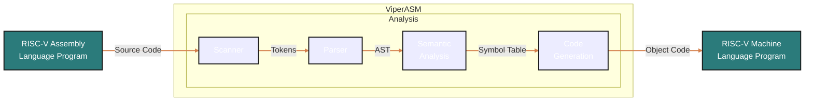

# ViperASM
An assembler for RISC-V written in Go (🚧 in construction 🚧)

```sh
./viperasm --filename=example.asm
```


```mermaid
graph LR
    A["RISC-V Assembly<br/>Language Program"] -->|Source Code| B[Scanner]
    
    subgraph "ViperASM"
        subgraph "Analysis"
            B -->|Tokens| C[Parser]
            C -->|AST| D[Semantic<br/>Analysis]
            D -->|Symbol Table| E[Code<br/>Generation]
        end
    end
    
    E -->|Object Code| F["RISC-V Machine<br/>Language Program"]
    
    style A fill:#2B7B7B,stroke:#1a1a1a,stroke-width:2px,color:#ffffff
    style B stroke:#1a1a1a,stroke-width:2px,color:#ffffff
    style C stroke:#1a1a1a,stroke-width:2px,color:#ffffff
    style D stroke:#1a1a1a,stroke-width:2px,color:#ffffff
    style E stroke:#1a1a1a,stroke-width:2px,color:#ffffff
    style F fill:#2B7B7B,stroke:#1a1a1a,stroke-width:2px,color:#ffffff
    
    linkStyle default stroke:#d4804d,stroke-width:2px
```
