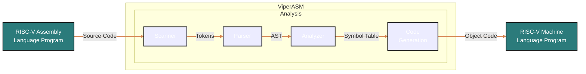

<!-- PROJECT SHIELDS -->
<!--
*** I'm using markdown "reference style" links for readability.
*** Reference links are enclosed in brackets [ ] instead of parentheses ( ).
*** See the bottom of this document for the declaration of the reference variables
*** for contributors-url, forks-url, etc. This is an optional, concise syntax you may use.
*** https://www.markdownguide.org/basic-syntax/#reference-style-links
-->
<div align="left">

[![Contributors][contributors-shield]][contributors-url]
[![Forks][forks-shield]][forks-url]
[![Stargazers][stars-shield]][stars-url]

</div>

<a href="https://github.com/Kaweees/ViperASM">
  
</a>

<div align="left">
  <h1><em><a href="https://miguelvf.dev/blog/dotfiles/compendium">~ViperASM</a></em></h1>
</div>

<!-- ABOUT THE PROJECT -->

An assembler for RISC-V (RV32I) written in Go.

### Built With

[![Go][Go-shield]][Go-url]
[![GitHub Actions][github-actions-shield]][github-actions-url]

<!-- GETTING STARTED -->

## Getting Started

### Prerequisites

Before attempting to build this project, make sure you have [Go](https://go.dev/doc/install) installed on your machine.

### Installation

To get a local copy of the project up and running on your machine, follow these simple steps:

1. Clone the project repository

   ```sh
   git clone https://github.com/Kaweees/ViperASM.git
   cd ViperASM
   ```

2. Build and run the project

   ```sh
   go build && ./viperasm --filename=example.asm
   ```

<!-- PROJECT FILE STRUCTURE -->

## Project Structure

### Project Architecture



### Project File Structure

```sh
ViperASM/
├── .github/                       - GitHub Actions CI/CD workflows
├── scripts/                       - Standalone scripts
├── shared/
│   └── utils/                     - Shared utility functions
├── src/                           - Project packages
│   ├── core/                      - Core application logic
│   └── ...                        - Other packages
├── tests/                         - Project tests (mirrors the main project structure)
├── .env.example                   - Reference environment variables file
├── LICENSE                        - Project license
└── README.md                      - You are here
```

## License

The source code for this project is distributed under the terms of the MIT License, as I firmly believe that collaborating on free and open-source software fosters innovations that mutually and equitably beneficial to both collaborators and users alike. See [`LICENSE`](./LICENSE) for details and more information.

<!-- MARKDOWN LINKS & IMAGES -->
<!-- https://www.markdownguide.org/basic-syntax/#reference-style-links -->

[contributors-shield]: https://img.shields.io/github/contributors/Kaweees/ViperASM.svg?style=for-the-badge
[contributors-url]: https://github.com/Kaweees/ViperASM/graphs/contributors
[forks-shield]: https://img.shields.io/github/forks/Kaweees/ViperASM.svg?style=for-the-badge
[forks-url]: https://github.com/Kaweees/ViperASM/network/members
[stars-shield]: https://img.shields.io/github/stars/Kaweees/ViperASM.svg?style=for-the-badge
[stars-url]: https://github.com/Kaweees/ViperASM/stargazers

<!-- MARKDOWN SHIELD BAGDES & LINKS -->
<!-- https://github.com/Ileriayo/markdown-badges -->

[Go-shield]: https://img.shields.io/badge/Go-%23008080.svg?style=for-the-badge&logo=go&logoColor=00ADD8&labelColor=222222&color=00ADD8
[Go-url]: https://go.dev/
[github-actions-shield]: https://img.shields.io/badge/github%20actions-%232671E5.svg?style=for-the-badge&logo=githubactions&logoColor=2671E5&labelColor=222222&color=2671E5
[github-actions-url]: https://github.com/features/actions
